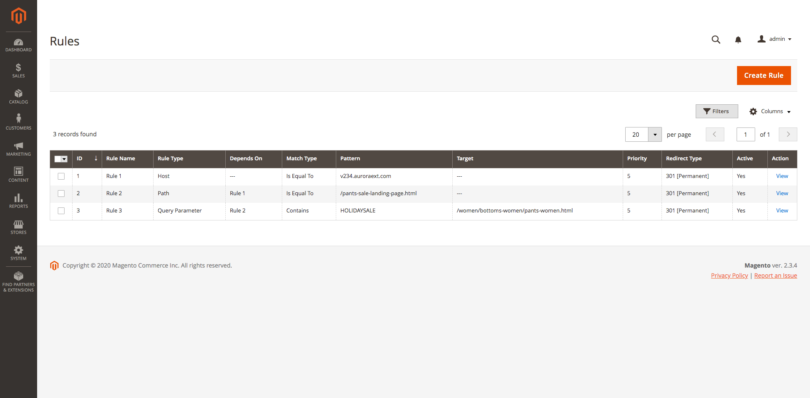

Simple Redirects v1.1.0
=======================

* Published: 2020-03-13
* Author: Nickolas Burr

.. contents:: Table of Contents
    :local:

.. note::

    If you would like to receive updates (like this one) by email, please consider
    subscribing to our quarterly newsletter. It is low volume, and includes details
    about upcoming releases, product updates, EOL announcements, and other related
    topics. You can subscribe `here <https://auroraextensions.com/>`_.

Links
-----

.. |changelog| replace:: CHANGELOG.txt
.. |docs| replace:: Documentation
.. |repo| replace:: Repository
.. |tar| replace:: auroraextensions_simpleredirects-1.1.0.tar.gz
.. |zip| replace:: auroraextensions_simpleredirects-1.1.0.zip

.. _changelog: https://docs.auroraextensions.com/magento/extensions/2.x/simpleredirects/CHANGELOG.txt
.. _docs: https://docs.auroraextensions.com/magento/extensions/2.x/simpleredirects/latest/
.. _repo: https://github.com/auroraextensions/simpleredirects
.. _tar: https://github.com/auroraextensions/simpleredirects/archive/1.1.0.tar.gz
.. _zip: https://github.com/auroraextensions/simpleredirects/archive/1.1.0.zip

* |repo|_
* |docs|_
* |changelog|_
* |zip|_
* |tar|_

Summary
-------

We've released Simple Redirects v1.1.0 and it contains several important updates and
new features, including `Composite Rules`_ and admin UI improvements.

Highlights
^^^^^^^^^^

* Composite rules (rule chaining)
* Admin UI improvements

Composite Rules
^^^^^^^^^^^^^^^

Starting in v1.1.0, rules can be linked together to create *composite rules*. This is
important because it provides the ability to match several conditions of requests and
respond more appropriately, as compared to only matching a single condition of requests.
Composite rules are especially useful when migrating to Magento from other platforms,
like Shopify or BigCommerce, where the structuring of URLs is substantially different.

Below is an example of three (3) atomic (single-purpose) rules that are linked together
to form a composite rule. Composite rules take the form of a directed tree and behave
in an upward, bubbling fashion, meaning rules are validated child => parent, but not
parent => child. The reason for this is because dependency metadata is stored on the
child rule, not the parent rule.

   Atomic rules link together to form one composite rule.

Changelog
---------

For complete changelog, see |changelog|_.

[1.1.0] ~ 2020-03-11
^^^^^^^^^^^^^^^^^^^^

Added
*****

* Add priority row to adminhtml simpleredirects_rule_view template
* Add basic rule chaining support in ``RuleValidator`` validation model
* Add ``Rule`` select source model
* Include ``name``, ``parent_id`` during save in adminhtml rule createPost, editPost controllers
* Add ``name``, ``parent_id`` form elements in simpleredirects_rule_form.xml
* Include rule name in adminhtml rule view details template
* Add ``parent_id`` column UI component class
* Add ``Target`` column UI component class
* Add Rule view model ``View::getParentName()`` method
* Add parent, target rows to simpleredirects_rule_view template
* Add ``CancelButton`` UI component class
* Add cancel button to simpleredirects_rule_form.xml
* Add adminhtml rule back button block
* Add back button block in adminhtml simpleredirects_rule_view.xml
* Add ``DeleteButton`` UI component class
* Add adminhtml simpleredirects_rule_deletePost controller
* Add adminhtml rule delete.js
* Add delete button in adminhtml simpleredirects_rule_form.xml

Changed
*******

* Update default value in ``ParentId::getLabel()``
* Set ``RuleInterface::getTarget()`` nullable return type
* Check if rule has target value in ``Router::match()``
* Make target column nullable in db_schema.xml
* Update button CSS class in adminhtml rule edit button block
* Update ``<actionsColumn>`` config in simpleredirects_rule_grid.xml
* Set ``RuleInterface::setParentId()`` parameter as nullable type

Removed
*******

* Remove validation for target field
* Remove edit button from simpleredirects_rule_grid actions column
